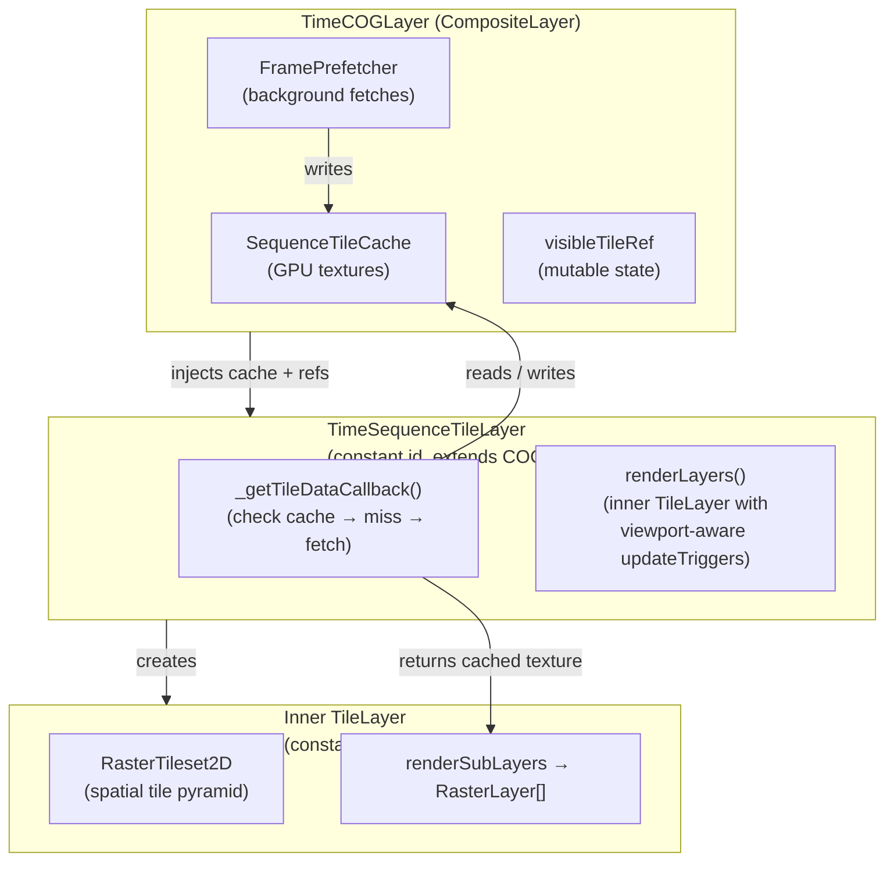
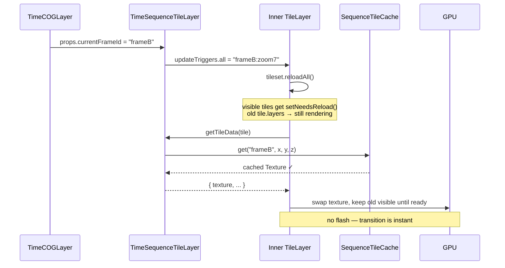
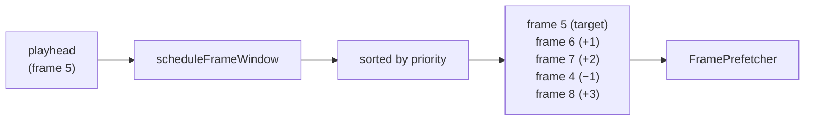
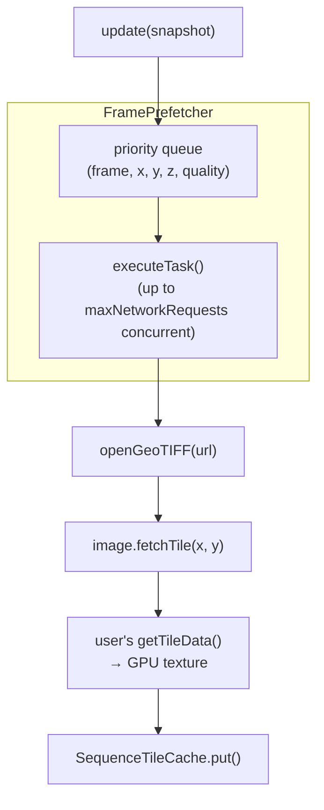
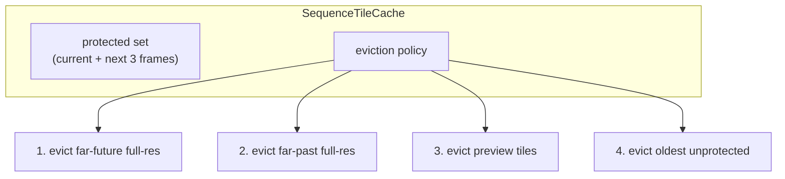

# time-cog-layer

A [deck.gl](https://deck.gl) `CompositeLayer` for flicker-free playback of time-indexed Cloud-Optimized GeoTIFF (COG) sequences. Designed for weather radar, satellite imagery, and other regularly-sampled raster time series.

```bash
npm install time-cog-layer
```

**Peer dependencies:** `@deck.gl/core` ≥9.3, `@deck.gl/geo-layers` ≥9.3, `@deck.gl/layers` ≥9.3, `@deck.gl/mesh-layers` ≥9.3, `@luma.gl/core` ≥9.3.2.

---

## Quick start

```ts
import { Deck } from "@deck.gl/core";
import { TimeCOGLayer } from "time-cog-layer";

const deck = new Deck({
  layers: [
    new TimeCOGLayer({
      id: "precip",
      frames: [
        { time: "2025-10-30T00:00:00Z", url: "/cogs/000.tif" },
        { time: "2025-10-30T00:02:00Z", url: "/cogs/002.tif" },
        { time: "2025-10-30T00:04:00Z", url: "/cogs/004.tif" },
      ],
      currentTime: Date.now(),
      playing: true,
      playbackRate: 60,  // 60× real-time (1 minute per second)
      getTileData: async (image, { device, x, y, signal, pool }) => {
        const tile = await image.fetchTile(x, y, { pool, signal });
        const texture = device.createTexture({ data: tile.array.data, /* ... */ });
        return { texture, width: tile.array.width, height: tile.array.height };
      },
      renderTile: (data) => ({
        renderPipeline: [
          { module: CreateTexture, props: { textureName: data.texture } },
          { module: MyColorRamp },
        ],
      }),
    }),
  ],
});
```

`getTileData` and `renderTile` follow the same signatures as [`@developmentseed/deck.gl-geotiff`](https://developmentseed.org/deck.gl-raster/api/geotiff/)'s `COGLayer`. Any existing COG render pipeline works unchanged.

---

## Props

| Prop | Type | Default | Description |
|---|---|---|---|
| `frames` | `TimeCOGFrame[]` | *required* | Ordered time → COG URL catalog. |
| `currentTime` | `number \| string \| Date` | *required* | Playhead position (epoch ms, ISO-8601, or `Date`). |
| `playing` | `boolean` | `false` | Whether playback is advancing. |
| `playbackRate` | `number` | `0` | Speed multiplier. `60` = 1 minute of data per real second. |
| `missingFramePolicy` | `"hold-last" \| "nearest" \| "skip" \| "transparent"` | `"hold-last"` | What to show when the playhead lands between catalog entries. |
| `bufferPolicy` | `TimeCOGBufferPolicy` | `{ backwardFrames: 2, forwardFrames: 6 }` | How many frames to prefetch ahead / retain behind. |
| `cachePolicy` | `TimeCOGCachePolicy` | `{}` | GPU / CPU tile cache limits. |
| `qualityPolicy` | `QualityPolicy` | `{}` | Progressive loading controls (preview-first, scrub bias). *Accepted; full implementation deferred.* |
| `schedulerPolicy` | `SchedulerPolicy` | `{ maxNetworkRequests: 4 }` | Prefetch concurrency and backpressure. |
| `getTileData` | `(image, options) => Promise<DataT>` | — | Load and upload a single COG tile to a GPU texture. Same signature as `COGLayer.getTileData`. |
| `renderTile` | `(data: DataT) => RenderTileResult` | — | Turn cached tile data into a shader pipeline. Same signature as `COGLayer.renderTile`. |
| `onFrameDisplayed` | `(frame) => void` | — | Fires when a new display frame becomes visible. |
| `onMissingFrame` | `(timeMs) => void` | — | Fires when the playhead has no exact catalog match. |
| `onBufferStateChange` | `(state) => void` | — | Buffer window and readiness summary. |
| `onStats` | `(stats) => void` | — | Periodic cache and prefetch statistics. |

All remaining props (`opacity`, `maxRequests`, `refinementStrategy`, `loadOptions`, `signal`, `pool`, `epsgResolver`, `onGeoTIFFLoad`, etc.) are forwarded to the underlying `COGLayer`.

---

## Architecture

### Why not one `COGLayer` per frame?

The naive approach creates a new `COGLayer` on every frame switch. deck.gl destroys the old layer — tearing down all GPU textures, decoded arrays, and in-flight fetches — and cold-starts the new layer. The gap produces a white flash.

`TimeCOGLayer` instead renders a **single persistent sublayer** with a constant `id`. Frame changes are communicated through prop updates, and deck.gl's built-in `updateTriggers` mechanism keeps old tile content visible **until** new data is ready.



### Flicker-free frame transitions

When `currentTime` changes, the parent computes a new display frame and updates `currentFrameId` on the persistent sublayer. 

deck.gl's `TileLayer.updateState` detects the trigger change, sets `dataChanged = true`, and calls `tileset.reloadAll()`. `reloadAll()` calls `setNeedsReload()` on every visible tile — this **does not clear `tile.content` or `tile.layers`**. The old rendered output stays on screen while new data loads.



Because the `FramePrefetcher` (see below) has been loading tiles for `frameB` in the background, `getTileData` nearly always hits the cache. The entire transition from old frame to new frame is a single GPU texture swap.

---

## Prefetching

### Frame scheduler



The `scheduleFrameWindow` function selects frames within a configurable buffer (default 2 backward, 6 forward) and scores them by distance from the playhead with a directional boost:

```
priority = 100 − (|distance| × 20) + directionalBoost
```

### Background tile prefetch



On every `updateState` the prefetcher receives the current visible tile coordinates, the scheduled frame window, and playback state. For each nearby frame (excluding the target, which the sublayer loads directly), it creates tasks and executes them concurrently up to `maxNetworkRequests` (default 4).

**Quality tiers:** Frames within ±2 steps of the playhead are fetched at `"full"` resolution. Farther frames are fetched at `"preview"` quality, biasing toward the next-coarser GeoTIFF overview. The cache's `put()` method silently ignores preview tiles when a full-res entry already exists, but upgrades preview → full when higher-quality data arrives.

Stale tasks (frames that leave the schedule window after a seek) are aborted via `AbortController`.

---

## Tile cache



The `SequenceTileCache` stores decoded GPU textures keyed by `(frameId, tileX, tileY, zoom)`. Protected frames (the current display frame and its nearest neighbours) are immune to eviction. The eviction policy prefers sacrificing distant full-resolution tiles over keeping close-to-playhead preview tiles, matching the research recommendation.

Destroying a cache entry calls `texture.destroy()` on the underlying luma.gl `Texture`, releasing GPU memory.

---

## Diagnostic minimap

The package exports a canvas-based diagnostic minimap that visualises tile state across the temporal sequence:

```ts
import { renderTileDiagnostics } from "time-cog-layer";

const canvas = document.querySelector("#diagnostics");
const snapshot = timeLayer.getDiagnosticSnapshot();
renderTileDiagnostics(canvas, snapshot);
```

**Axes and colours:**

```
         frame 0     1     2     3     4     5     6     7     8     9
    ──────┬─────┬─────┬─────┬─────┬─────┬─────┬─────┬─────┬─────┬──────
   z2 │▓▓▓▓▓│▓▓▓▓▓│▓▓▓▓▓│▓▓▓▓▓│░░░░░│▓▓▓▓▓│▓▓▓▓▓│▓▓▓▓▓│░░░░░│
   z1 │ ▓▓▓  │ ▓▓▓  │ ▓▓▓  │ ▓▓▓  │ ░░░  │ ▓▓▓ ∇│ ▓▓▓  │ ░░░  │
   z0 │  ▓   │  ▓   │  ▓   │  ▓   │      │  ▓   │  ▓   │      │
    ──────┴─────┴─────┴─────┴─────┴─────┴─────┴─────┴─────┴─────┴──────
    past: 4 cached   │   future: 2 prefetched
                      ▲ playhead
```

| Colour | Meaning |
|---|---|
| 🟢 Green | Cached full-resolution tile |
| 🔵 Blue | Cached preview (overview) tile |
| 🔴 Red | Visible in viewport, still loading |
| ⬛ Dark | Not yet loaded |

The X axis spans a 60-frame window centered on the playhead. Pink triangle marks the current display frame. Summary text at bottom shows contiguous cached frames before and after the playhead.

---

## API reference

### `TimeCOGFrame`

```ts
type TimeCOGFrame = {
  id?: string;                   // stable identifier (auto-derived if omitted)
  time: number | string | Date;  // timestamp (epoch ms, ISO-8601, or Date)
  url: string | URL;             // COG URL
  requestInit?: RequestInit;     // forwarded to fetch() when opening the COG
  meta?: Record<string, unknown>; // opaque metadata
};
```

### `MissingFramePolicy`

```ts
type MissingFramePolicy = "hold-last" | "nearest" | "skip" | "transparent";
```

| Policy | Behaviour |
|---|---|
| `"hold-last"` (default) | Show the most recent frame at or before the requested time. Least visually disruptive. |
| `"nearest"` | Show the closest frame by absolute time difference. |
| `"skip"` | Show nothing (`displayFrame` is `null`). |
| `"transparent"` | Show nothing (`displayFrame` is `null`). |

### `TimeCOGBufferPolicy`

```ts
type TimeCOGBufferPolicy = {
  backwardFrames?: number;  // default 2
  forwardFrames?: number;   // default 6
};
```

### `TimeCOGCachePolicy`

```ts
type TimeCOGCachePolicy = {
  memoryBytes?: number;     // max total GPU bytes
  maxFrames?: number;       // max distinct frames in cache
  maxTileEntries?: number;  // max individual tile entries
  maxTiles?: number;        // alias for maxTileEntries
};
```

### `SchedulerPolicy`

```ts
type SchedulerPolicy = {
  maxNetworkRequests?: number;     // default 4 — prefetch concurrency
  maxDecodeTasks?: number;         // deferred
  maxGpuUploadsPerFrame?: number;  // deferred
};
```

### Callbacks

```ts
onFrameDisplayed?: (frame: NormalizedTimeCOGFrame) => void;
onMissingFrame?: (timeMs: number) => void;
onBufferStateChange?: (state: TimeCOGBufferState) => void;
onStats?: (stats: TimeCOGStats) => void;
```

---

## Development

```bash
npm install
npm run build          # compile TypeScript
npm test               # build + run tests
npm run dev            # dev server with demo
npm run build:demo     # production demo build
npm run preview        # preview production demo
```
